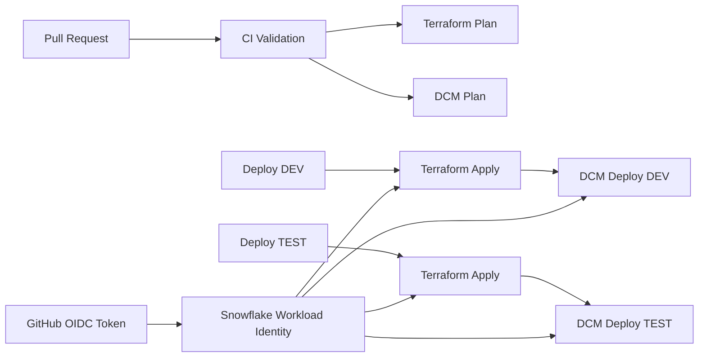

# Snowflake DCM CI/CD Repository Demo Guide

## 1. Repository Overview

This repository demonstrates a Snowflake CI/CD model using three technologies:

1. GitHub Actions for automation.
2. Terraform for foundation infrastructure.
3. Snowflake DCM for databases and data objects.

The overall deployment flow is:



The repository is divided into three main layers:

- Authentication and automation through GitHub Actions.
- Foundation infrastructure through Terraform.
- Snowflake data objects through DCM definitions.

## 2. Project Configuration

The central DCM configuration is in `manifest.yml`.

```yaml
manifest_version: 2
type: DCM_PROJECT

default_target: DEV
```

The default target is DEV. The manifest defines two deployment targets:

- `DEV`
- `TEST`

Both targets currently point to the same Snowflake project and account:

```yaml
project_name: DEMO_DB.PUBLIC.DEMO_DCM_DB
account_identifier: IVULRLR-AL32991
```

The target controls which deployment context DCM uses:

```bash
snow dcm deploy --target DEV -x
snow dcm deploy --target TEST -x
```

The environments are logically separated by workflow target and GitHub environment, although they currently reference the same Snowflake account and project.

## 3. Snowflake Object Definitions

The DCM source definitions are under `sources/definitions`.

These files describe the desired Snowflake objects that DCM should manage.

### 3.1 Database Schemas

`sources/definitions/database.sql` defines three schemas:

```sql
DEFINE SCHEMA DEMO_DB.RAW;
DEFINE SCHEMA DEMO_DB.CURATED;
DEFINE SCHEMA DEMO_DB.STAGING;
```

Their intended purposes are:

- `RAW`: source or unprocessed data.
- `STAGING`: intermediate transformation data.
- `CURATED`: prepared data for analytics and consumption.

### 3.2 Roles

`sources/definitions/roles.sql` defines two roles:

```sql
DEFINE ROLE DATA_ENGINEER_ROLE;
DEFINE ROLE DATA_ANALYST_ROLE;
```

This separates engineering permissions from analyst permissions.

### 3.3 Tables

`sources/definitions/tables.sql` defines a customer table:

```sql
DEFINE TABLE DEMO_DB.RAW.CUSTOMERS (
  CUSTOMER_ID NUMBER,
  CUSTOMER_NAME VARCHAR
);
```

The table belongs to the `RAW` schema and contains a numeric customer ID and a customer name.

### 3.4 Grants

`sources/definitions/grants.sql` assigns access:

```sql
GRANT USAGE ON DATABASE DEMO_DB TO ROLE DATA_ENGINEER_ROLE;
GRANT USAGE ON SCHEMA DEMO_DB.RAW TO ROLE DATA_ENGINEER_ROLE;
GRANT USAGE ON SCHEMA DEMO_DB.CURATED TO ROLE DATA_ANALYST_ROLE;
```

The grants demonstrate role-based access control managed as code:

- `DATA_ENGINEER_ROLE` receives database usage.
- `DATA_ENGINEER_ROLE` receives usage on the `RAW` schema.
- `DATA_ANALYST_ROLE` receives usage on the `CURATED` schema.

### 3.5 Warehouse

`sources/definitions/warehouse.sql` defines a small transformation warehouse:

```sql
DEFINE WAREHOUSE TRANSFORM_WH
WAREHOUSE_SIZE='XSMALL'
AUTO_SUSPEND=60
AUTO_RESUME=TRUE;
```

It is configured to:

- Use the `XSMALL` size.
- Suspend after 60 seconds of inactivity.
- Resume automatically when needed.

## 4. DCM Database Layout

The `db` directory contains folders for:

- Databases.
- Schemas.
- Tables.
- Roles.
- Grants.

Those folders are currently empty. The active DCM definitions are in `sources/definitions`.

For the demo, explain `sources/definitions` as the current source-of-truth layer. The `db` folders appear to be reserved for a future or alternate DCM project layout.

## 5. Terraform Foundation Layer

Terraform is located under `terraform`.

The intended architecture assigns Terraform responsibility for Snowflake foundation resources such as:

- Service users.
- Security integrations.
- Storage integrations.
- Network policies.
- Cloud resources.

However, the current Terraform implementation is intentionally small.

### 5.1 Terraform Role

`terraform/main.tf` currently defines one Snowflake account role:

```hcl
resource "snowflake_account_role" "tf_platform_role" {
  name = "TF_PLATFORM_ROLE_V1"
}
```

This is the only active Terraform resource in the repository at present.

### 5.2 Provider Configuration

`terraform/providers.tf` configures the Snowflake provider to use workload identity authentication:

```hcl
authenticator = "WORKLOAD_IDENTITY"
```

It targets:

```hcl
account_name     = "AL32991"
organization_name = "IVULRLR"
```

The provider currently uses the `ACCOUNTADMIN` role. This is suitable for an early demonstration, but a production implementation should use a narrowly scoped administrative role.

### 5.3 Version Constraints

`terraform/versions.tf` requires:

- Terraform version `1.5.0` or newer.
- The Snowflake provider from `snowflakedb/snowflake`.

`terraform/variables.tf` is currently empty. Account, organization, role, and environment values are therefore not parameterized yet.

### 5.4 Terraform Modules

The `terraform/modules` directory contains module folders for areas such as:

- Network policies.
- Security integrations.
- Storage integrations.
- Users.

These modules are currently empty or not connected to `terraform/main.tf`. They represent planned extension points for the foundation layer.

## 6. GitHub OIDC Authentication

The workflows grant GitHub permission to request an OIDC token:

```yaml
permissions:
  id-token: write
  contents: read
```

Each workflow installs the Snowflake GitHub Action:

```yaml
- uses: snowflakedb/snowflake-actions@v3
  with:
    use-oidc: true
```

The action obtains a GitHub-issued identity token and uses it to authenticate to Snowflake through workload identity.

The important environment variables are:

```yaml
SNOWFLAKE_USER: ...
SNOWFLAKE_WORKLOAD_IDENTITY_PROVIDER: OIDC
```

`SNOWFLAKE_USER` must match the Snowflake user associated with the authenticated workload identity. If the token authenticates as `GITHUB_TEST_SVC` but the command requests `GITHUB_DCM_SVC`, Snowflake returns an error similar to:

```text
LOGIN_NAME in the request does not match the authenticated workload identity user
```

## 7. CI Validation Workflow

The validation pipeline is in `.github/workflows/ci-validation.yml`.

It runs for:

- Pull requests targeting `main`.
- Manual workflow dispatch.

It has two jobs.

### 7.1 Terraform Plan

The `terraform-plan` job:

1. Checks out the repository.
2. Authenticates to Snowflake with OIDC.
3. Installs Terraform.
4. Runs `terraform init`.
5. Runs `terraform validate`.
6. Runs `terraform plan`.

This validates the foundation layer without applying changes.

### 7.2 DCM Plan

The `dcm-plan` job runs:

```bash
snow dcm plan --target DEV -x
```

This previews changes to DCM-managed Snowflake objects.

The key presentation point is that pull requests can show both:

- Infrastructure changes from Terraform.
- Data object changes from DCM.

## 8. DEV Deployment Workflow

The DEV deployment is defined in `.github/workflows/deploy-dev.yml`.

It can be started manually using `workflow_dispatch`.

### 8.1 Terraform Job

The `terraform-apply` job:

1. Checks out the repository.
2. Authenticates using GitHub OIDC.
3. Installs Terraform.
4. Initializes Terraform.
5. Imports the existing `TF_PLATFORM_ROLE_V1` role if it is not already in local state.
6. Runs `terraform apply -auto-approve`.
7. Prints Snowflake-related environment variables for diagnostics.

The import step exists because GitHub-hosted runners are ephemeral. Each run starts with a new local Terraform state file. Snowflake may already contain the role, while Terraform does not yet know that it owns the role.

The DEV Terraform job uses:

```yaml
SNOWFLAKE_USER: GITHUB_DCM_SVC
SNOWFLAKE_WORKLOAD_IDENTITY_PROVIDER: OIDC
```

### 8.2 DCM Job

The `dcm-deploy` job waits for Terraform:

```yaml
needs: terraform-apply
```

It then authenticates with OIDC and runs:

```bash
snow dcm deploy --target DEV -x
```

The DEV DCM job also uses `GITHUB_DCM_SVC`, so both jobs request the same workload identity.

## 9. TEST Deployment Workflow

The TEST deployment is defined in `.github/workflows/deploy-test.yml`.

It follows the same two-stage process:

```text
Terraform apply -> DCM deploy
```

The important differences are the identity and GitHub environment.

Both TEST jobs use:

```yaml
SNOWFLAKE_USER: GITHUB_TEST_SVC
SNOWFLAKE_WORKLOAD_IDENTITY_PROVIDER: OIDC
```

Both jobs use the GitHub TEST environment:

```yaml
environment:
  name: TEST
```

This ensures the Terraform and DCM jobs use the same TEST environment context.

The DCM command is:

```bash
snow dcm deploy --target TEST -x
```

This separation prevents an identity mismatch where Terraform authenticates as `GITHUB_TEST_SVC`, but the DCM job requests `GITHUB_DCM_SVC`.

## 10. Deployment Sequence

The complete deployment sequence is:

```text
1. GitHub Actions starts on manual dispatch or pull request.
2. GitHub issues an OIDC token because id-token: write is enabled.
3. Snowflake Actions configures workload identity authentication.
4. Terraform initializes the provider.
5. Terraform imports an existing role when necessary.
6. Terraform applies foundation resources.
7. The DCM job waits for Terraform to succeed.
8. Snowflake DCM deploys the selected DEV or TEST target.
```

For DEV:

```bash
terraform apply
snow dcm deploy --target DEV -x
```

For TEST:

```bash
terraform apply
snow dcm deploy --target TEST -x
```

## 11. Recommended Demo Walkthrough

### Step 1: Start with the architecture

Explain that the repository separates:

- Authentication.
- Foundation infrastructure.
- Snowflake data objects.
- Validation and deployment automation.

### Step 2: Show the manifest

Open `manifest.yml` and explain the DEV and TEST targets.

Emphasize that the same DCM project can be deployed to different targets.

### Step 3: Show the object definitions

Walk through these files in order:

1. `sources/definitions/database.sql`
2. `sources/definitions/roles.sql`
3. `sources/definitions/tables.sql`
4. `sources/definitions/grants.sql`
5. `sources/definitions/warehouse.sql`

Explain that these files describe the desired Snowflake state declaratively.

### Step 4: Show Terraform

Open `terraform/main.tf` and explain the foundation role.

Then show `terraform/providers.tf` and explain that Terraform connects to Snowflake through workload identity rather than a stored password.

### Step 5: Show CI validation

Open `.github/workflows/ci-validation.yml`.

Explain that every pull request can validate both layers before deployment:

- Terraform plan.
- DCM plan.

### Step 6: Show deployment

Open `.github/workflows/deploy-dev.yml` and explain:

```text
Authenticate -> Terraform init -> Import existing role -> Terraform apply -> DCM deploy
```

Then compare it with `.github/workflows/deploy-test.yml` and highlight:

- Different target.
- Different workload identity.
- TEST GitHub environment.
- Same deployment structure.

### Step 7: Show the Snowflake result

After the workflow completes, demonstrate:

- The database and schemas.
- The `CUSTOMERS` table.
- The roles.
- The grants.
- The warehouse.
- The Terraform-managed role.

## 12. Important Current-State Caveats

These points should be explained honestly during the demo:

1. Terraform currently manages only one account role, despite the architecture documentation describing a larger foundation layer.

2. The repository does not currently define a Terraform remote backend. GitHub runners are temporary, so Terraform state is not persisted between runs.

3. The workflows compensate by importing the existing role before applying.

4. DEV and TEST currently point to the same Snowflake account and DCM project.

5. DEV uses `GITHUB_DCM_SVC` for both Terraform and DCM.

6. TEST uses `GITHUB_TEST_SVC` for both Terraform and DCM.

7. A future production design could use separate identities for each responsibility:

```text
GITHUB_DEV_TERRAFORM_SVC
GITHUB_DEV_DCM_SVC
GITHUB_TEST_TERRAFORM_SVC
GITHUB_TEST_DCM_SVC
```

8. The provider currently uses `ACCOUNTADMIN`; a production implementation should use least-privilege roles.

## 13. Suggested Presentation Summary

Use this summary at the end of the demo:

> This project demonstrates a two-layer Snowflake deployment architecture. Terraform manages the foundation layer, while Snowflake DCM manages databases, schemas, tables, roles, grants, and warehouses. GitHub Actions provides CI validation and deployment automation. Authentication uses GitHub OIDC and Snowflake workload identity, so the workflows do not require long-lived passwords. Pull requests run Terraform and DCM plans, while manual DEV and TEST workflows apply the foundation layer first and then deploy the Snowflake object layer to the selected target.

## 14. Key Files

| File | Purpose |
|---|---|
| `manifest.yml` | Defines the DCM project and DEV/TEST targets |
| `sources/definitions/database.sql` | Defines Snowflake schemas |
| `sources/definitions/roles.sql` | Defines Snowflake roles |
| `sources/definitions/tables.sql` | Defines the customer table |
| `sources/definitions/grants.sql` | Defines role permissions |
| `sources/definitions/warehouse.sql` | Defines the transformation warehouse |
| `terraform/main.tf` | Defines the Terraform-managed account role |
| `terraform/providers.tf` | Configures Snowflake workload identity authentication |
| `terraform/versions.tf` | Defines Terraform and provider requirements |
| `.github/workflows/ci-validation.yml` | Runs Terraform and DCM plans |
| `.github/workflows/deploy-dev.yml` | Applies Terraform and deploys the DEV DCM target |
| `.github/workflows/deploy-test.yml` | Applies Terraform and deploys the TEST DCM target |
| `docs/Architecture.md` | High-level architecture notes |
